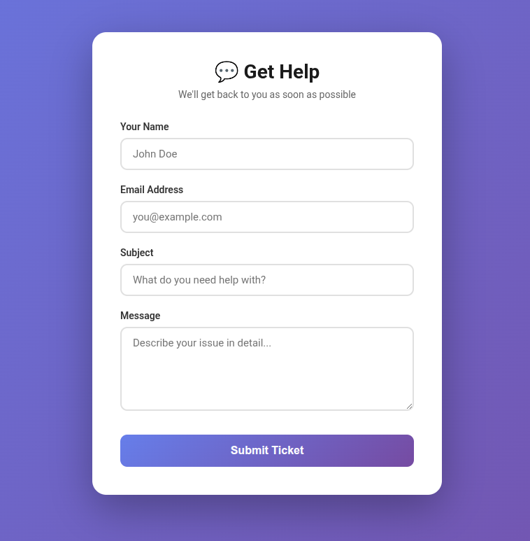
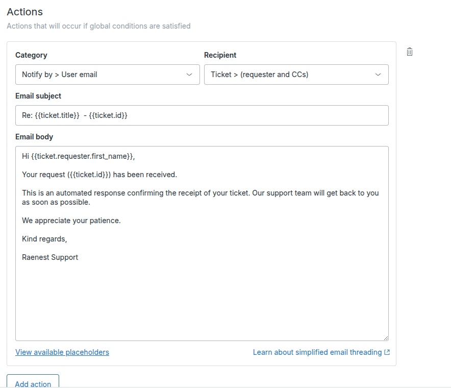
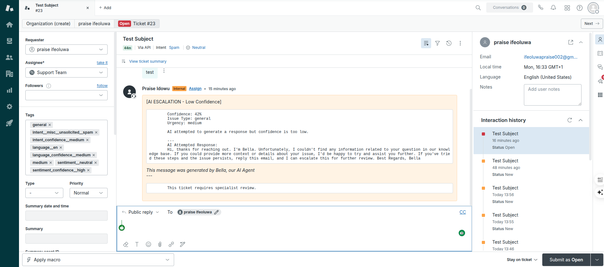
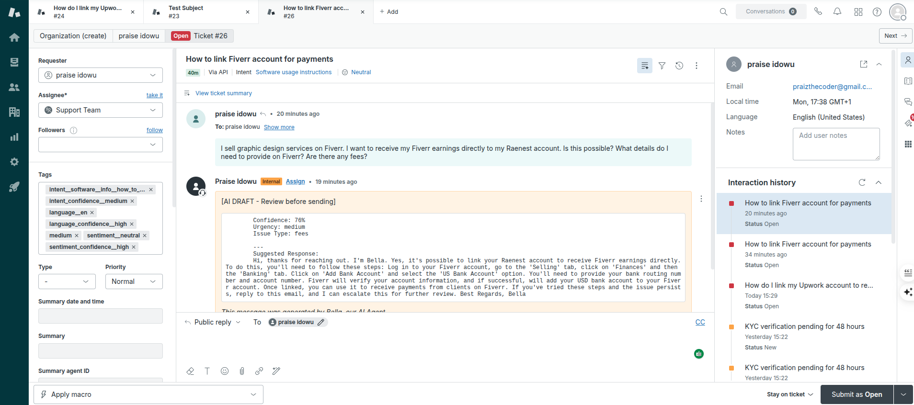
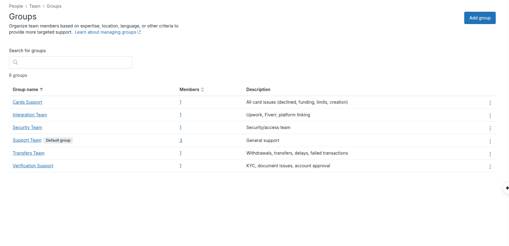
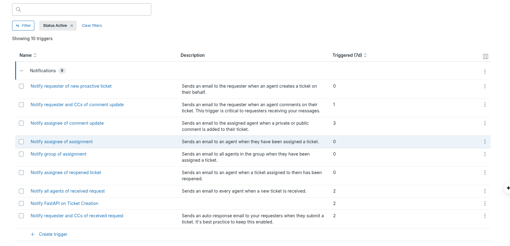
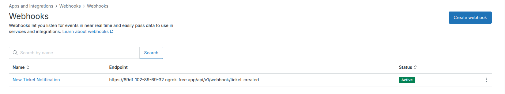
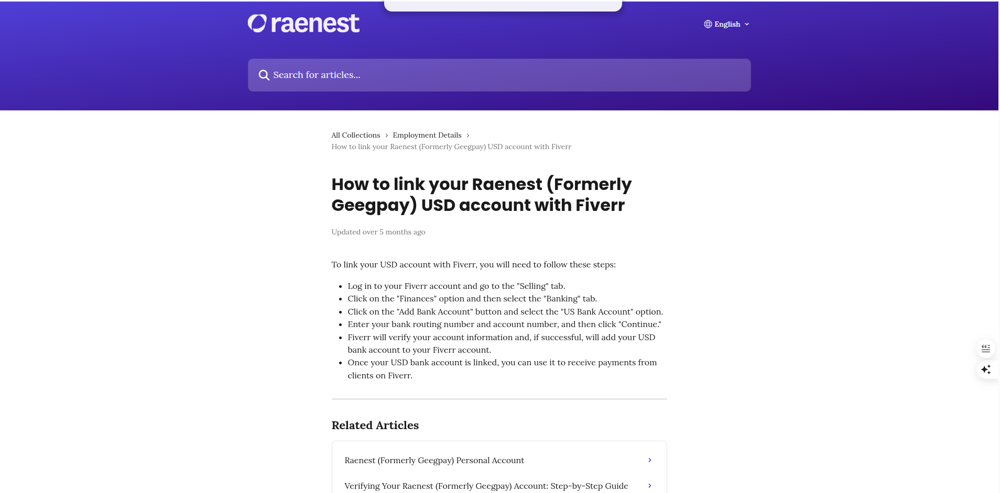

# Intelligent Customer Support Ticket Router & Resolver

An advanced AI-powered customer support system that automatically classifies, resolves, and routes support tickets using multi-signal confidence scoring and LangGraph workflows.

> Intelligent ticket classification, routing, and auto-resolution system for Raenest 

[](https://drive.google.com/drive/folders/1DToVZn78bmB4GmG1them9CpMtOZdW1Wc)

---

## 🎯 The Problem

Customer support teams are overwhelmed with tickets that could be automatically resolved or properly routed, leading to slow response times and poor customer satisfaction.

The solution is an AI agent that analyzes incoming support tickets, extracts key information, checks a knowledge base, and either resolves the ticket automatically or routes it to the appropriate specialist with context.

---

## ✨ The Solution

An **AI-powered ticket routing system** that:

✅ **Auto-classifies** tickets by type (KYC, cards, transfers, integrations)  
✅ **Assesses urgency** (high, medium, low priority)  
✅ **Generates responses** using RAG (Retrieval-Augmented Generation)  
✅ **Routes intelligently** based on confidence:
   - 🟢 **High confidence (>85%):** Auto-resolve → Send to customer
   - 🟡 **Medium (60-85%):** Human review → Assign to team with AI draft
   - 🔴 **Low (<60%):** Escalate → Alert specialist team

---

## 🎬 Demo

**Watch the system in action:**

[▶️ **Demo Video**](https://drive.google.com/drive/folders/1DToVZn78bmB4GmG1them9CpMtOZdW1Wc)

**What you'll see:**
1. Customer submits ticket via web form
2. Ticket appears in Zendesk
3. AI classifies and processes
4. Response generated and routed

---

## 🏗️ Architecture

For a more detailed explanation of the system architecture, please see the [System Design](system-design.md) document.
```
Customer Ticket(webhook triggered when email received or web form submission)
      ↓
   Zendesk
      ↓
  FastAPI → Input Guardrails (block spam/injection)
      ↓
  Celery Queue (priority-based)
      ↓
  ┌─────────────────────────┐
  │  LangGraph Workflow     │
  │  1. Classify (LLM)      │
  │  2. RAG (ChromaDB)      │
  │  3. Generate Response   │
  │  4. Calculate Confidence│
  │  5. Route Decision      │
  └─────────────────────────┘
      ↓
  ┌─────────┬──────────┬──────────┐
  │         │          │          │
Auto-Resolve Human-Review Escalate
(by issue type)
                            ↓
                       cards   → #cards-team
                       integration → #integration-team
                       security   → #security-team
                       support   → #support-team
                       transfer   → #transfer-team
                       verification → #verification-team
```

**Tech Stack:**
| Component | Technology |
|-----------|------------|
| Backend API | FastAPI |
| Frontend | React |
| AI Orchestration | LangChain + LangGraph |
| Vector Database | ChromaDB |
| Relational Database | PostgreSQL |
| Queue | Redis |
| Text Classifier | facebook/bart-large-mnli (zero-shot) |
| Ticket Ingestion | Zendesk Webhooks & Create ticket endpoint |
| Escalation Notifications | Zendesk & Email |
| Guardrails | Input validation, prompt injection detection(guardrailsai) |
| LLM | NVIDIA llama, Groq |


---

## 📊 Key Features

### 1️⃣ **Intelligent Classification**
- 7 issue types: KYC, Cards, Transfers, Integrations, Fees, Account Access, General
- 3 urgency levels: High, Medium, Low
- LLM-powered understanding of context

### 2️⃣ **RAG-Powered Responses**
- Knowledge base: Raenest help center documentation
- Vector search with ChromaDB
- Context-aware answer generation

### 3️⃣ **Confidence-Based Routing**
```
Confidence = 0.4×RAG_score + 0.3×Semantic_similarity + 0.3×LLM_confidence

>85%: Auto-resolve (instant customer reply)
60-85%: Human review (AI draft for agent)
<60%: Escalate (specialist team + Slack alert)
```

### 4️⃣ **Security: Input Guardrails**
- Blocks prompt injection attempts
- Filters toxic/abusive language
- Spam detection
- Jailbreak prevention

### 5️⃣ **Security: Input Guardrails**
- State machine for reliable ticket processing

---

## 🎯 Impact Metrics (Projected)

| Metric | Actual | Target |
|--------|--------|-------------------|
| **Auto-resolution rate** | 0% | 60-70% |
| **Average response time** | 5 minutes - 24 hours | 5 minutes - 24 hours |
| **Customer satisfaction** | In progress ⭐ | 4.5/5 ⭐ (target) |
| **Agent efficiency** | 50+ tickets/day | 50+ tickets/day |

---

## 📸 Screenshots

### Ticket Submission Form


### Zendesk Integration







### Comparing Raenest Help vs AI response



---

## What's Working

✅ Web form → Zendesk ticket creation  
✅ Webhook integration  
✅ Input guardrails (security filters)  
✅ LLM classification  
✅ RAG knowledge retrieval  
✅ Confidence scoring  
✅ Routing to different queues  

---

## 🏗️ In Progress / Future Work

🔨 **Performance optimization:**
- Lazy loading models (reduce FastAPI startup time)
- Celery stability improvements

🔨 **Accuracy tuning:**
- Fine-tune confidence thresholds
- Expand knowledge base
- A/B testing routing decisions

🔨 **Dashboard:**
- Real-time metrics
- Auto-resolution success rate
- Agent performance tracking

---

## 💡 Project Highlights

1. **Hybrid AI approach:** LLM classification + RAG retrieval + confidence scoring
2. **Security-first:** Input guardrails prevent abuse before processing
3. **Production-ready architecture:** Async processing, priority queues, monitoring
4. **Context-aware routing:** Not just classification - intelligent decision-making

---

## 🛠️ Setup & Installation

### Prerequisites
- Python 3.12+
- PostgreSQL
- Redis
- Zendesk account

### Quick Start
```bash
# Clone repo
git clone <repo_url>

cd <dir_name>

# Create virtual env(Linux)
python3 -m venv .venv

# Create virtual env(Windows)
.venv\Scripts\activate

# Activate virtualenv
source venv/bin/activate

# Install dependencies
pip install -r requirements.txt

# Setup environment
cp .env.example .env
# Add your API keys

# Run migration
alembic upgrade head

# Start FastAPI
uvicorn src:app --reload

# Start docker
docker run -d --name redis -p 6379:6379 redis

# Start Celery
celery -A src.tickets.celery_config.celery_app worker --loglevel=info   -Q classification,processing
```

---

## 👨‍💻 Built By

**Praise Idowu** - Backend/AI Engineer  

[LinkedIn](https://www.linkedin.com/in/praise-ifeoluwa-idowu-back-end-developer-django/)
 | [Twitter](https://x.com/PraiseID3?t=S6pVclNj0uw4vMgvEykOqQ&s=0)

**Built for:** DevCareer × Raenest Freelancer Hackathon

---

## 📝 License

MIT

---

## 🙏 Acknowledgments

- Raenest x DevCareer for organizing the hackathon
- NVIDIA for API access